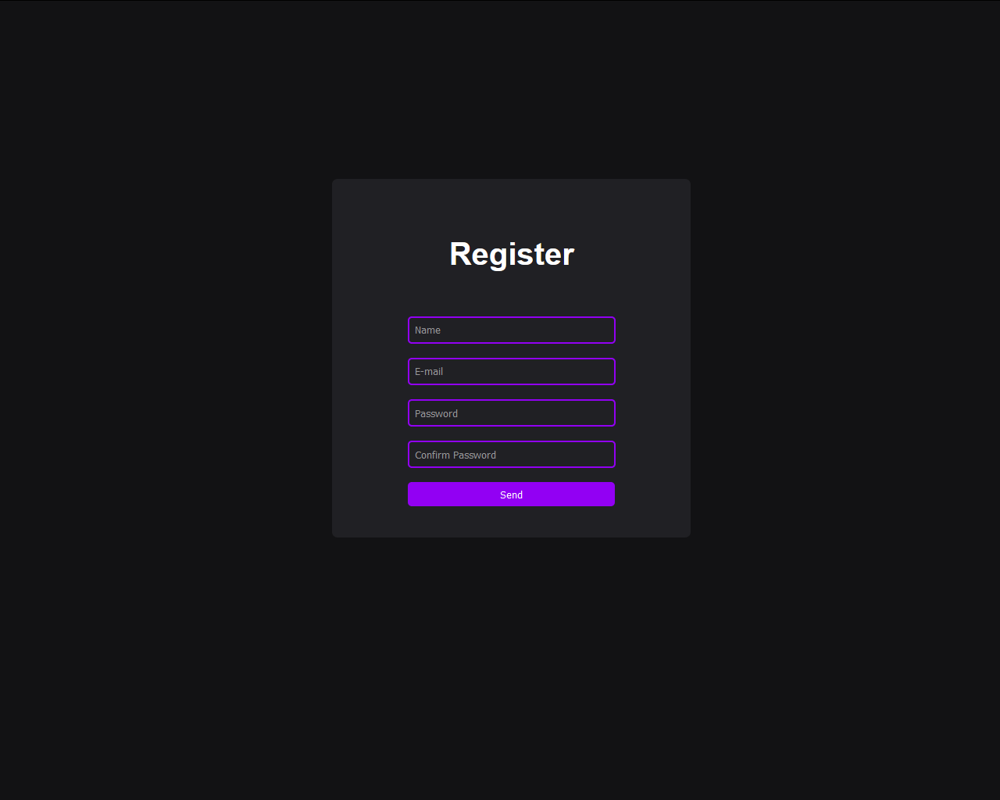

# Codar 
### Practicing my knowledge in html, css, js.

- Create a html login page that contains a submit button.

- Create a javascript function that validates the data.

- Using the XML object javascript, collect the dada in the post method to autheticate in the api.

